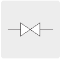

# Dynamic SVG Symbols
We need to be able to display symbols on a map that could have an arbitrary value. The value should determine the look of the symbol by dynamically adjusting certain parameters such as color, rotation, scale and translation. 

The parameters that should be adjusted are specified within the SVG symbol. This guide highlights the required parameters in order to enable dynamic manipulation of the symbols.

Examples of SVG files that have been modified to support dynamic adjustment can be found in the `src/assets` folder.

## General
To ensure that the correct part of the SVG file is used as the symbol, the `sSymbol` class needs to be added to the root group (`<g>`) element, e.g:
```xml
<g class="sSymbol">
```

## Symbol types

The following symbol types are currently implemented. 

### Boolean
Symbols that indicates one of two states - true or false. This could be used by symbols such as valves, switches or pumps.




Elements within "Boolean" type symbols that should change dynamically are specified by the designer by adding the `sBoolean` class to the element. This will indicate that the sibling classes on this element should receive a new class based on the state. The sibling classes will be appended with `--true` or `--false`, for example:

```xml
<rect class="sBoolean rect-class-1" width="10" height="10" />
```

Will receive an additional `rect-class-1--true` class if it is currently in the `true` state:
```xml
<rect class="sBoolean rect-class-1 rect-class-1--true" width="10" height="10" />
```

This new class can be used to change the look of the element by changing certain style values such as the fill: 
```xml
<defs>
    <style>
        .rect-class-1,
        .rect-class-1--true {
            fill: #231f20;
        }

        .rect-class-1--false {
            fill: #fff;
        }
    </style>
</defs>
```

### Value
These symbols indicates the status based on a variable value, such as the level of a reservoir, temperature presented as a thermometer, or a gauge indicator.


In order to handle various changes in style or look to symbols, the following modifiers are supported.

#### sStyle
Classes on elements that has the `sStyle` class applied will have one of the following classes applied as the value changes:

1. High - `--high`
1. Default - no addition
1. Low - `--low`

The values for each of the classes can be defined in the following manner:
```xml
<defs>
    <style>
        .cls-dm-1 { 
            fill: #007bc6;
        }
        
        .cls-dm-1--low { 
            fill: #e8194d;
        }
        
        .cls-dm-1--high { 
            fill: #1ca547;
        }
    </style>
</defs>
```

#### sTranslateY
Some parts of the symbol may be expected to move up and down based on the value. These elements can be indicated by applying the `sTranslateY` class. They will be translated on the Y-axis by the current value.

If the part should not move the full length of the symbol an offset value can be specified by adding the `translate-offset` attribute to the same translated element, for example:
```xml
<g class="sTranslateY" translate-offset="-160" >
```

The `scada_tank.svg` symbol implements the `sTranslateY` modifier and can be used as an example.

#### sRotate
Certain symbols contains parts that should be rotated to indicate progress, such as gauges or variable valve positions. The `sRotate` class should be applied to identify a part that needs to rotate. Rotation requires a few other attributes to be applied to the rotating part:

| Attribute | Purpose | Example |
| --------- | ------- | :-------: |
| `rotate-start` | Limit the degrees of rotation (in conjuction with `rotate-stop`) | 45 |
| `rotate-stop` | Limit the degrees of rotation (in conjuction with `rotate-start`) | 265 |
| `rotate-x` | Indicates the x-value of the point around which the rotation should occur | 5.5 |
| `rotate-y` | Indicates the y-value of the point around which the rotation should occur | -3.4 |
| `rotate-transform` | Any transforms that are applied to the rotation element needs to be applied as part of the rotation as well. This resets the coordinate position to ensure rotation as expected. | translate(-5, 3) |

```xml
<g  class="sRotate" 
    rotate-start="0" 
    rotate-stop="265" 
    rotate-x="33.4" 
    rotate-y="-6.5935" 
    rotate-transform="translate(-9.5, 18) rotate(45, 17.5, -0.5)" >
```

#### sScaleY & sClipPath
A common way of indicating a changing level on a symbol is to gradually fill a shape within the symbol. This can be achieved by adding the `sScaleY` class to the element that should be used as the filler. This must always be used in conjuction with a `clip-path` attribute.

A new `clipPath` element needs to be added to the SVG. This clip path defines the shape that can be filled and excludes anything that falls outside of this shape.  The `sClipPath` class also needs to be added to this clip path for it to work correctly.

An easy way of setting this up is making the filler element (with the `sScaleY` class applied) a rectangle that fills the entire width of the symbol, and clipping irrelevant parts. The scale will adjusted on the Y-axis to grow or shrink as needed.

The following example indicates the use of the above mentioned attributes and classes:
```xml
<clipPath class="sClipPath" id="fill-tower" >
    <path d="M 54.1994 272.0462 L 54.1994 272.0462 z "/>
</clipPath>
<g class="sSymbol">
    ...
    <rect class="sScaleY sStyle ts-1" width="100%" clip-path="url(#fill-tower)" />
</g>
```
